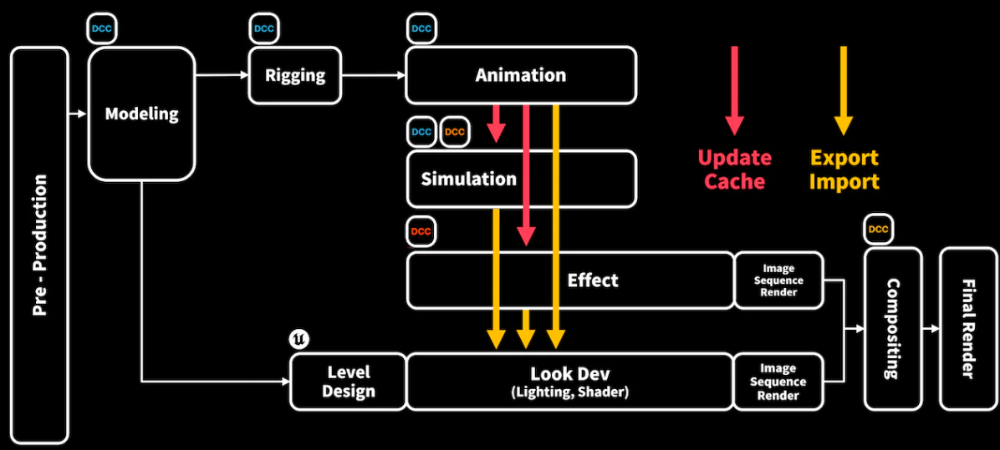
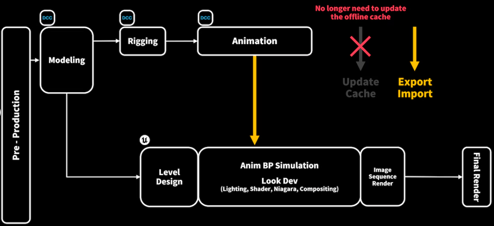
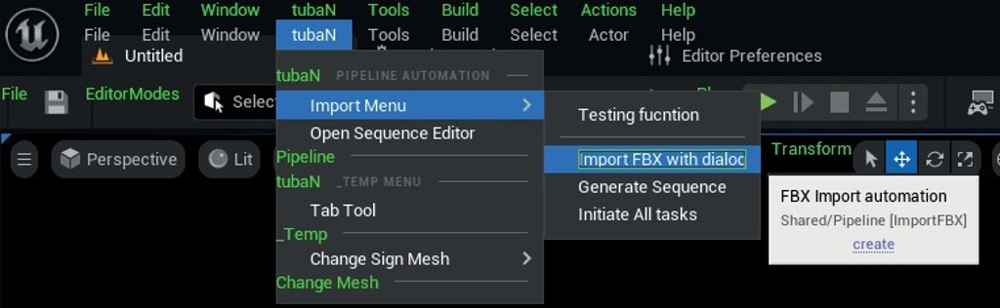
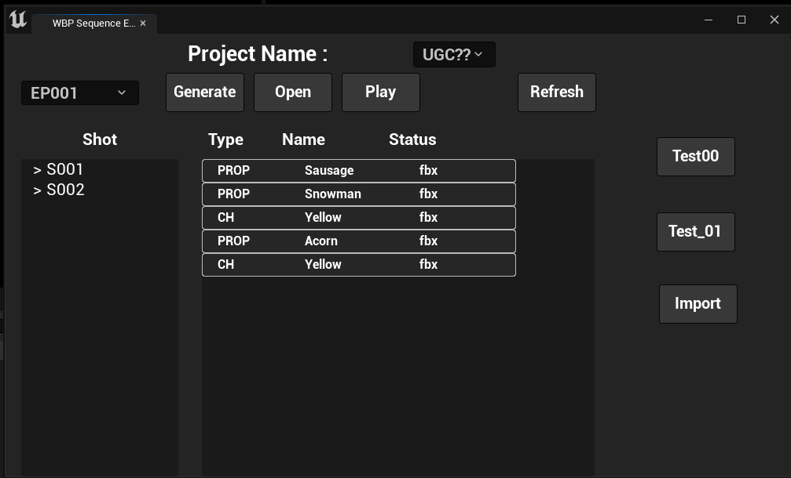
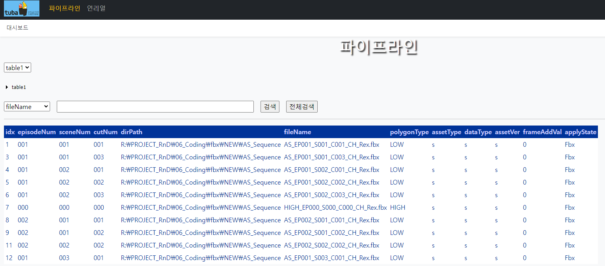

# Animation Production Pipeline Using Unreal Engine

## Preface
- This is a tool for automating FBX import and Sequence creation for animation production in Unreal Engine.
- It is developed as an Editor Toolbar Extension Plugin.
- Files are imported and created according to our own naming conventions and production standards, which are managed in [AssetInfo](./Common/AssetInfo.h).
- Additionally, key strings based on these conventions, as well as important frame and resolution settings, are categorized and managed under [Common](./Common/Common.h).




## FBX Importer
- Get files by own naming convention
	```cpp
	 AssetInfo::AssetInfo()
		: prefixAsset()
		, episodeNumber()
		, sceneNumber()
		, cutNumber()
		, isExtraCut(false)
		, type()
		, name()
		, extension()
	{
	}
	```
- Import automation to specific folder
	```cpp
	void AssetInfo::SetPaths()
	{
		episodeDir = episodeNumber + TEXT_SLASH;
		episodeName = episodeNumber + TEXT_UNDERSCORE;
		sceneDir = sceneNumber + TEXT_SLASH;
		sceneName = sceneNumber + TEXT_UNDERSCORE;
		cutDir = cutNumber + TEXT_SLASH;
		cutName = cutNumber + TEXT_UNDERSCORE;
	}
	```

## Sequence Generator
- Create files by own naming convention

## Packet Manager for Web Server
- Check asset data
- Collecting logs
  	```cpp
   #pragma once
	#include "CoreMinimal.h"
	#include "PacketManager.h"
	
	DECLARE_LOG_CATEGORY_EXTERN(MYLog, Log, All);
	
	//`1. To string called fucntion & line number
	#define LOG_INFO (FString(__FUNCTION__) + TEXT("(") + FString::FromInt(__LINE__) + TEXT(")"))
	//`2. Print n1 macro
	#define LOG_S(Verbosity) UE_LOG(MYLog, Verbosity, TEXT("%s"), *LOG_INFO)
	//`3. Print info & text
	#define LOG(Verbosity, Format, ...) UE_LOG(MYLog, Verbosity, TEXT("%s %s"), *LOG_INFO, *FString::Printf(Format, ##__VA_ARGS__))
	//`4. Print assertion
	#define CHECK_EXIT(Expr, ...) {if(!(Expr)) {LOG_SERVER(Error, TEXT("Assertion : %s"), TEXT("<"#Expr">")); return __VA_ARGS__;}}
	//`5. Print assertion with condition
	#define ENSURE_EXIT(Expr, ...) {if(ensure(Expr) == false) {LOG_SERVER(Error, TEXT("Assertion : <"#Expr"> --> %s"), (##__VA_ARGS__)); return;}}
	//`6. Print log on screen
	#define	LOG_SCREEN(Format, ...) GEngine->AddOnScreenDebugMessage(-1, 5.f, FColor::Red, FString::Printf(Format, ##__VA_ARGS__))
	//`7. Print log on server
	#define LOG_Address FPlatformProcess::ComputerName()
	#define LOG_SERVER_INFO(Format, ...) (LOG_INFO + " --> ") + (TEXT("%s"), *FString::Printf(Format, ##__VA_ARGS__))
	#define LOG_SERVER_S(Verbosity) APacketManager::Instance()->SendUnrealLog(""#Verbosity"", LOG_INFO, LOG_Address)
	#define LOG_SERVER(Verbosity, Format, ...) APacketManager::Instance()->SendUnrealLog(""#Verbosity"", FString(LOG_SERVER_INFO(Format, ##__VA_ARGS__)), LOG_Address)
   	```

## Usage Examples



